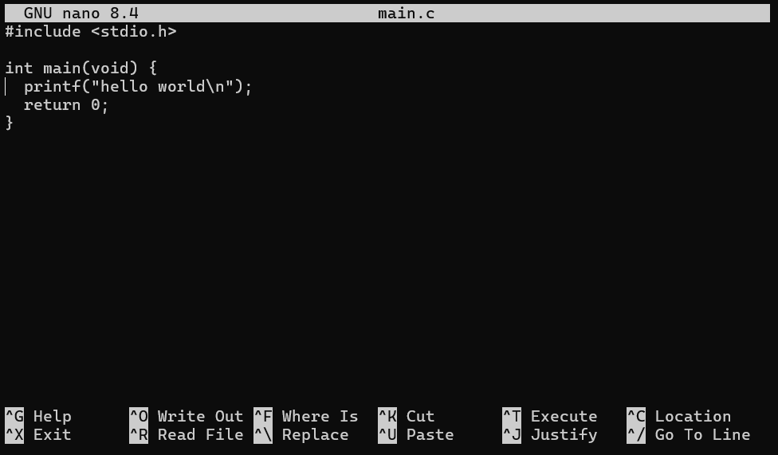

# PachaOS

> FD pure microkernel OS written in Zig — Linux ABI compatible, userland-first.


既存の Linux エコシステムとの互換を目指すマイクロカーネル。  
musl libc をネイティブでサポートし、カーネルのコード量は 20,000 行未満（現在約 16,000 行）に抑えています。

---

## Features

- **Pure Microkernel** — カーネルは ファイルディスクリプタ 管理・スケジューリング・trap delegation のみを担当
- **FD-based Microkernel** — Capabilityとほぼ特性の同じ権限ベースのFD(File Descriptor)を採用していて、厳格なセキュリティとLinux ABIおよびPOSIXの相性の良さを両立しています
- **Trap Delegation** — Linux syscall をカーネルが解釈せず、capability で制御されたユーザーランドサーバーが処理
- **Hardware FD** — capsule を用いた、デバイスアクセスおよび特権命令の抽象化
- **Linux ABI Compatibility** — 無改造の musl libc を動的リンクでロードし、Linux syscall をユーザーランドで処理
- **Userland Drivers** — virtio-blk / virtio-net などドライバはすべてユーザー空間で動作
- **x86_64** — x86_64 対応。AArch64 は今後対応予定
- **Native Libc** — musl libcを互換レイヤーを用いず、ネイティブで動かせます
- **Minimal Kernel** — 20k以下を維持するマイクロカーネルです。(現在16k) 
  
## Tech Stack

| Layer | Language | Detail |
|---|---|---|
| Kernel | Zig | Freestanding / UEFI boot / x86_64 |
| Userland | C / CMake | musl libc / ELF loader / Linux ABI server |

---

## Linux Applications

Trap delegation により、無改造の Linux バイナリがそのまま動作します。  
musl ビルドで確認済み（glibc も動作）。

`Python 3` &nbsp; `Vim` &nbsp; `Clang` &nbsp; `apk` &nbsp; `nano` &nbsp; `Lua` &nbsp; `W3M`

### Python3 on PachaOS

```pycon
Python 3.12.13 (main, Apr 10 2026, 14:16:05) [GCC 14.2.0] on linux
Type "help", "copyright", "credits" or "license" for more information.
>>> import os
>>> print("os.uname():", os.uname())
os.uname(): posix.uname_result(sysname='Linux', nodename='capabilityos', release='6.0.0-capabilityos', version='CapabilityOS Linux ABI', machine='x86_64')
>>>
```

### apk + clang on PachaOS

```sh
# apk add nano
fetch http://dl-cdn.alpinelinux.org/alpine/v3.22/main/x86_64/APKINDEX.tar.gz
fetch http://dl-cdn.alpinelinux.org/alpine/v3.22/community/x86_64/APKINDEX.tar.gz
(1/3) Installing ncurses-terminfo-base (6.5_p20250503-r0)
(2/3) Installing libncursesw (6.5_p20250503-r0)
(3/3) Installing nano (8.4-r0)
OK: 464 MiB in 28 packages
# nano main.c
```



```sh
# clang main.c
# ls
a.out  main.c
# ./a.out
hello world
```

---

## kobox — Linux Kernel Driver Runtime

[](https://github.com/kamedaga/kobox)

[kobox](https://github.com/kamedaga/kobox) は Linux カーネル向けドライバ (`.ko`) をユーザーランドプロセスとして直接実行するランタイムです。  
バックエンドを実装することで任意の OS に対応でき、PachaOS では独自 Capsule を用いて動作します。

**PachaOS Capsule バックエンドで動作中:**

| Driver | Module |
|---|---|
| NVMe | `nvme.ko` / `nvme-core.ko` |
| USB Storage | `usbcore.ko` / `usb-storage.ko` / `xhci-hcd.ko` |
| USB HID(マウスで実験中) | `usbcore.ko` / `hid.ko` / `hid-generic.ko` / `usbhid.ko` / `xhci-hcd.ko`|

※koboxはApache 2.0でライセンスされてます。

---

## Build

```powershell
nix develop
./pacgo sync rootfs
./pacgo qemu --new-terminal
```

詳細は [ビルドガイド](pacha_docs/build.md) を参照してください（動作確認済みバージョン・依存関係など）。

---

## License

PachaOS source code is licensed under the **MIT License**.  
Third-party runtime components are documented in [THIRD_PARTY_NOTICES.md](./THIRD_PARTY_NOTICES.md).
